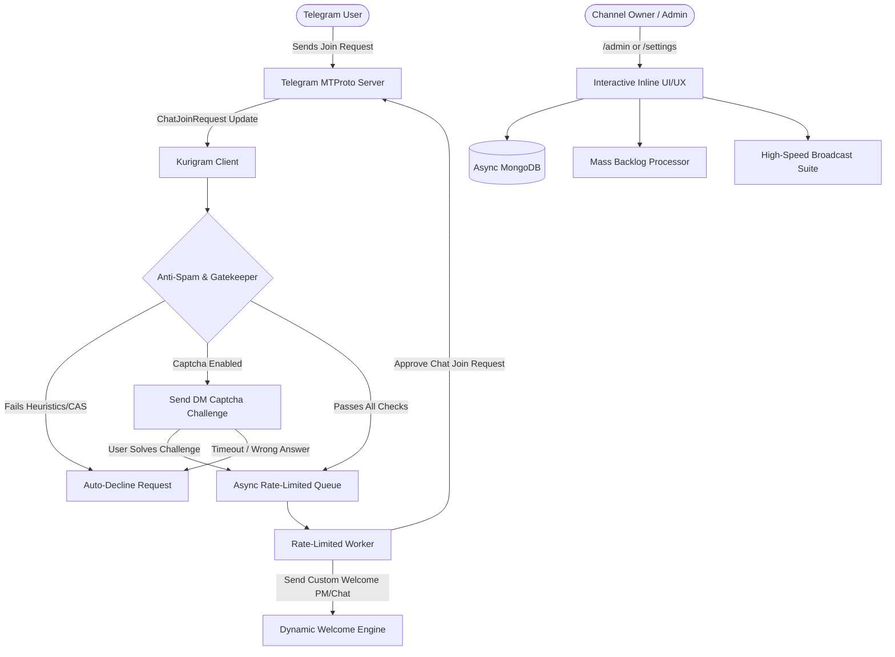

# Project Specification: Telegram Auto-Approval & Join Request Bot

## 1. Overview
**Auto-Approve-Bot** is a high-throughput, feature-rich open-source Telegram bot engineered with **[Kurigram](https://github.com/KurimuzonAkuma/kurigram)** (actively maintained Pyrogram fork) and **Async MongoDB (Motor)** to automate join request approvals across unlimited Telegram Channels and Supergroups.

---

## 2. System Architecture



---

## 3. Technology Stack & Frameworks

| Layer | Technology | Purpose |
| :--- | :--- | :--- |
| **Telegram Framework** | **[Kurigram](https://github.com/KurimuzonAkuma/kurigram)** (Pyrogram MTProto) | Actively maintained fork with stories, topics, gifts & latest updates |
| **Database** | **Motor (Async MongoDB)** | Production-grade async document database with indexing |
| **Networking & HTTP** | **aiohttp** | Async API lookups for Combot Anti-Spam (CAS) |
| **Concurrency & Queuing** | **asyncio.Queue & Token Bucket** | Safe rate limiting to avoid Telegram `FloodWait` (420) exceptions |
| **Templating Engine** | **Safe HTML Regex Formatter** | Dynamic variable substitution (`{mention}`, `{chat_title}`, etc.) |
| **Containerization** | **Docker & Docker Compose** | Simple containerized deployment with MongoDB service |

---

## 4. Simplified Universal File Structure

```
Auto-Approve-Bot/
├── main.py              # Application entry point & lifecycle manager
├── config.py            # Centralized settings & access control
├── database.py          # Async MongoDB driver (Motor)
├── helpers.py           # Keyboards, formatters, captcha & spam checks
├── plugins/             # Auto-loaded modular plugins
│   ├── start.py         # /start, /help, /ping & main menu
│   ├── join_request.py  # ChatJoinRequest listener & queue worker
│   ├── captcha.py       # DM captcha verification callbacks
│   ├── admin.py         # Channel control center & toggle switches
│   ├── welcome.py       # Custom welcome message, media & button editor
│   ├── mass.py          # Bulk approvals, declines & CSV export
│   ├── broadcast.py     # High-speed broadcast suite with live progress
│   └── stats.py         # Global and chat analytics
├── project.md           # Architecture specifications
├── FEAtures.md          # Comprehensive feature matrix
├── README.md            # GitHub documentation & setup guide
├── requirements.txt     # Python dependencies
├── .env.example         # Environment template
├── Dockerfile           # Docker container configuration
├── docker-compose.yml   # Multi-container orchestration
└── LICENSE              # MIT License
```

